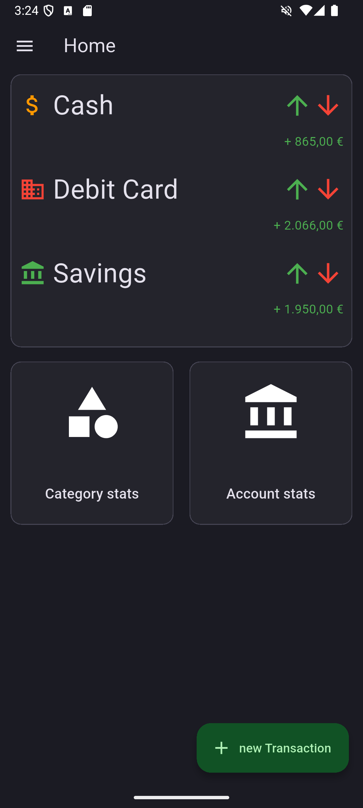
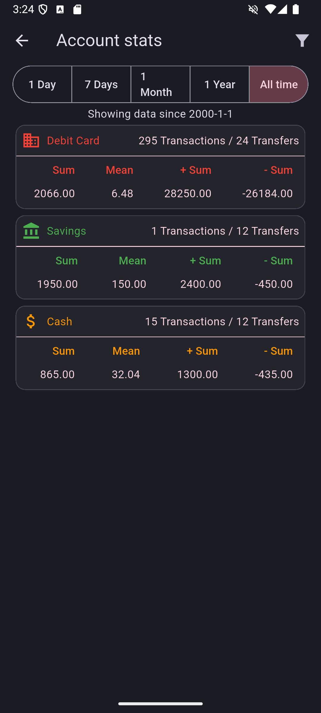
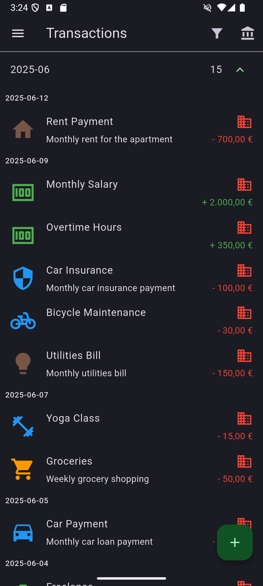
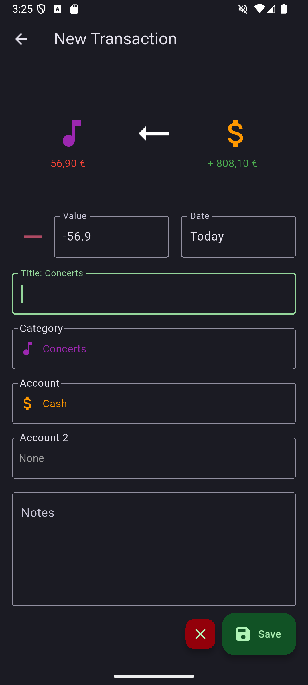

# Budgetiser

  <a href="http://budgetiser.de">Website</a> •
  <a href="#features">Features</a> •
  <a href="https://play.google.com/store/apps/details?id=de.budgetiser.budgetiser">Installation</a> •
  <a href="#usage">Usage</a> •
  <a href="assets/how-to.md">Quick start guide</a> •
  <a href="https://github.com/budgetiser/budgetiser?tab=GPL-3.0-1-ov-file#readme">License</a>

Your personal, open source Finance Tracker.

## Features

- 100% offline
- Flexible setup of accounts, categories and budgets
- Customization with icons and colors
- Im/export to json

## Screenshots

  
  
  
  

