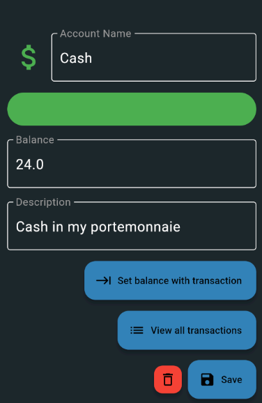
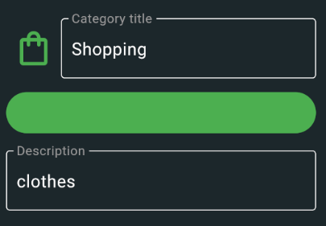
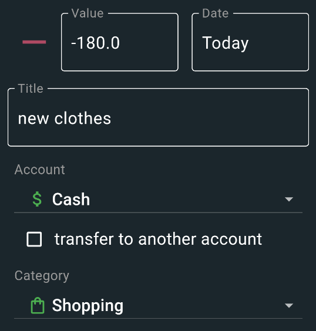

# Quick start

## Account

Navigate to the account section in the drawer on the left and create your first account.
Enter an account name and the current account balance.
Optionally, you can customize the appearance of your account by selecting a different icon or color. This will help you visually distinguish your account from others.

## Category

Now create a category for your first transaction. Navigate to the category section on the left. The process is similar to the account creation.

## Transaction

Now you are ready to create your first transaction.
Fill in the field and use the account and category you created in the previous steps.

Congratulations! You have successfully created your first account, category and transaction in the application. You can now start using it for managing and organizing your finances efficiently.

# Im-/Export

See settings.
