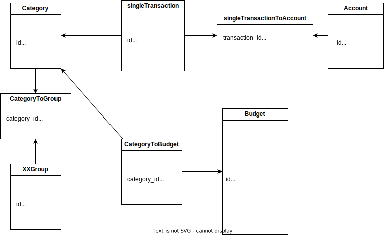
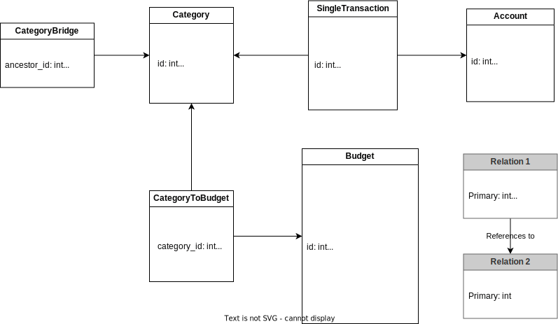

# Budgetiser

### App Icon

used: https://romannurik.github.io/AndroidAssetStudio/icons-launcher.html

then move the folders from the zip to android/app/src/main/res

other way: configure in pubspec.yaml and then run "flutter pub run flutter_launcher_icons:main"

### DB

Import/Export:

- file path on emulator: `/storage/emulated/0/Android/data/de.budgetiser.budgetiser/files/downloads/`

#### Old Model

#### Current Model

- Dates are stored as integer (milliseconds since UNIX)
- archived default is 0
  - when an account/category is archived:
    - not visible in dropdown anymore (transaction form)
    - listed separately in account screen
    - still listed and used in stats/budgets
      - multi selector with greyed out but still visible & usable

Budget

- interval unit : daily, weekly, monthly, quarterly, yearly, lifetime
- shows only current interval

Transactions:

- with 1 account:
  - account2_id: null
  - transaction value is added to account balance
- with 2 accounts:
  - transaction value is only positive and subtracted from account1 and added to account2

Category:

see: [Bridge Table or Closure Table](https://www.databasestar.com/hierarchical-data-sql/#:~:text=specific%20use%20case-,Bridge%20Table%20or%20Closure%20Table,-The%20Bridge%20Table)
