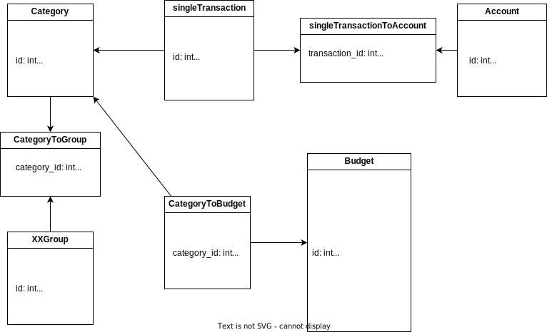
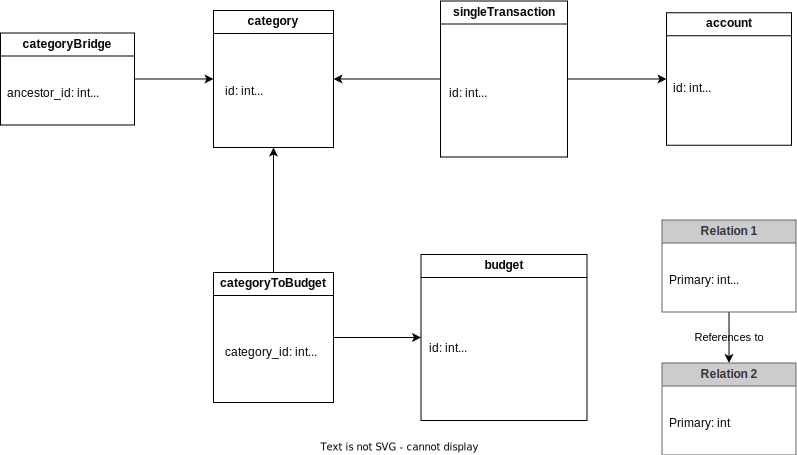

# Budgetiser

### App Icon

used: https://romannurik.github.io/AndroidAssetStudio/icons-launcher.html

then move the folders from the zip to android/app/src/main/res

other way: configure in pubspec.yaml and then run "flutter pub run flutter_launcher_icons:main"

### DB

[Overview of hierarchical data modelling](https://www.databasestar.com/hierarchical-data-sql/#:~:text=specific%20use%20case-,Bridge%20Table%20or%20Closure%20Table,-The%20Bridge%20Table)

#### Old Model

#### New Model

#### Implementation

Budget
- IntervalRepititions = 1 -> no repitition
- interval_repititions and end_date remain empty/null for endless repititions

Dates are stored as integer (milliseconds since UNIX)